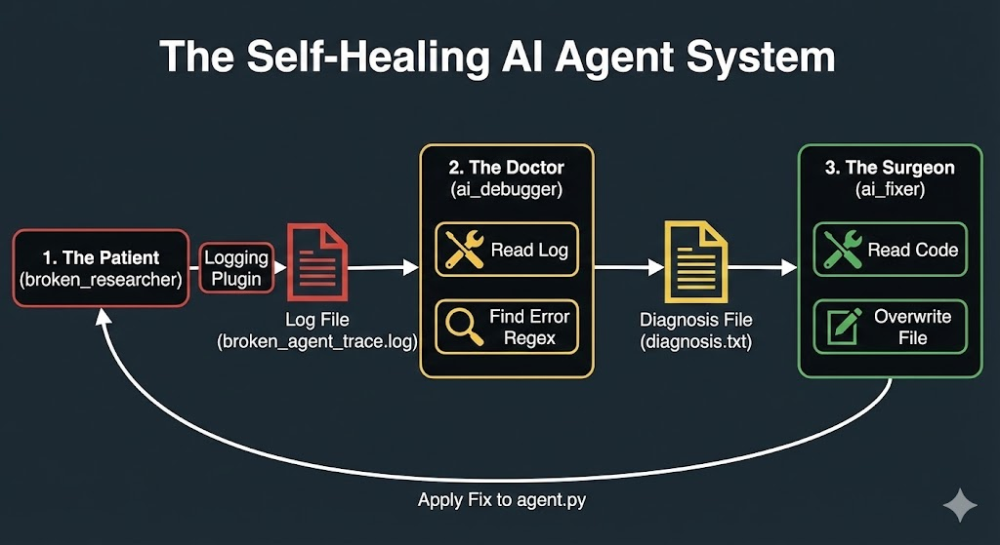

# 🚀 AI Agent Mechanic: The Self-Healing AI System
**A Capstone Project for the 5-Day AI Agents Intensive Course.**

**Track:** Freestyle

---

## 1. The Pitch: Problem, Solution, Value

### **The Problem (The "Why")**
AI Agents are powerful, but when they fail, they are a "black box." They produce long, messy, and technical trace logs that are difficult for developers to parse and impossible for non-technical users to understand. Even worse, fixing these bugs requires manual intervention, slowing down development cycles.

### **The Solution (The "What")**
This project is an **"AI Agent Mechanic"**—a fully autonomous, self-healing multi-agent system.

It works in three phases:
1.  **Crash:** A "Broken Agent" runs and fails, producing a messy technical log.
2.  **Diagnose:** The "AI Mechanic" reads the log, analyzes the error, and writes a simple English diagnosis.
3.  **Heal:** The "AI Surgeon" reads the diagnosis, opens the actual source code of the broken agent, and **rewrites the code to fix the bug automatically.**

### **The Value (The "Impact")**
This turns a 30-minute debugging session into a 10-second autonomous fix.
* **For Developers:** Massively speeds up debugging and repair.
* **For Teams:** Allows non-technical stakeholders to understand failures.
* **For the Future:** Demonstrates the potential for self-maintaining AI software.

---

## 2. The Implementation: Architecture & Code

### Architecture Diagram


### System Components
This is a multi-agent system composed of three distinct agents:

1.  **Agent A: `broken_researcher` (The Patient)**
    * **Role:** A simple researcher agent designed with a flaw. Its `count_papers` tool requires a `List`, but its instructions trick it into passing a `String`.
    * **Output:** Generates a messy `broken_agent_trace.log` file upon failure.

2.  **Agent B: `ai_debugger` (The Doctor)**
    * **Role:** An observability agent.
    * **Custom Tools:**
        * `read_log_file`: Reads the raw trace logs.
        * `find_last_error_in_trace`: Uses Regex to pinpoint the exact failure point.
    * **Output:** Generates a `diagnosis.txt` file explaining the root cause in plain English.

3.  **Agent C: `ai_fixer` (The Surgeon)**
    * **Role:** A software engineering agent capable of modifying files.
    * **Custom Tools:**
        * `read_code_file`: Reads the broken source code.
        * `apply_fix_to_file`: Overwrites the file with corrected code.
    * **Output:** A repaired `agent.py` file that runs successfully.

### Key Course Concepts Applied (4+)
* **[✅] Multi-agent System:** Three distinct agents collaborating asynchronously via files (Logs -> Diagnosis -> Code).
* **[✅] Custom Tools:** Built 4 custom tools for file reading, log parsing, and code editing.
* **[✅] Observability:** Leveraged the `LoggingPlugin` to capture traces and built an agent specifically to analyze those traces.
* **[✅] Agent Deployment:** The `ai_debugger` agent is configured for deployment to **Vertex AI Agent Engine**.

---

## 3. How to Run This Project

### Prerequisites
1.  Clone this repository.
2.  Install dependencies:
    ```bash
    pip install -r requirements.txt
    ```
3.  Get a Gemini API Key from **Google AI Studio**.
4.  Paste your API key into the `.env` files in each agent folder (`broken_researcher/.env`, `ai_debugger/.env`, `ai_fixer/.env`).

### The Self-Healing Demo
Run these three scripts in order to see the magic happen.

**Step 1: Create the Crash**
```bash
python 1_create_error_log.py // It crashes! A broken_agent_trace.log file is created
python 2_run_debugger.py // It reads the log and prints a diagnosis. A diagnosis.txt file is created.
python 3_run_fixer.py // It reads the diagnosis, edits broken_researcher/agent.py, and fixes the bug. You can now run Step 1 again, and it will succeed!
```