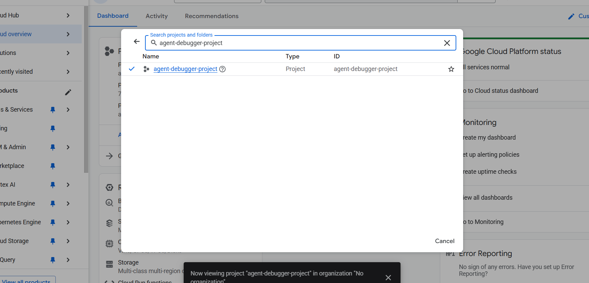

# 🚀 The Self-Healing AI Agent System
**A Capstone Project for the 5-Day AI Agents Intensive Course.**

**Track:** Freestyle

---

## 1. The Pitch: Problem, Solution, Value

### **The Problem (The "Why")**
AI Agents are powerful, but when they fail, they are a "black box." They produce long, messy, and technical trace logs that are difficult for developers to parse and impossible for non-technical users to understand. Even worse, fixing these bugs requires manual intervention, slowing down development cycles.

### **The Solution (The "What")**
This project is an **"AI Agent Mechanic"**—a fully autonomous, self-healing multi-agent system.

It works in three phases:
1.  **Crash:** A "Broken Agent" runs and fails, producing a messy technical log.
2.  **Diagnose:** The "AI Mechanic" reads the log, analyzes the error, and writes a simple English diagnosis.
3.  **Heal:** The "AI Surgeon" reads the diagnosis, opens the actual source code of the broken agent, and **rewrites the code to fix the bug automatically.**

### **The Value (The "Impact")**
This turns a 30-minute debugging session into a 10-second autonomous fix.
* **For Developers:** Massively speeds up debugging and repair.
* **For Teams:** Allows non-technical stakeholders to understand failures.
* **For the Future:** Demonstrates the potential for self-maintaining AI software.

---

## 2. The Implementation: Architecture & Code

### Architecture Diagram


### System Components
This is a multi-agent system composed of three distinct agents:

1.  **Agent A: `broken_researcher` (The Patient)**
    * **Role:** A simple researcher agent designed with a flaw. Its `count_papers` tool requires a `List`, but its instructions trick it into passing a `String`.
    * **Output:** Generates a messy `broken_agent_trace.log` file upon failure.

2.  **Agent B: `ai_debugger` (The Doctor)**
    * **Role:** An observability agent.
    * **Custom Tools:**
        * `read_log_file`: Reads the raw trace logs.
        * `find_last_error_in_trace`: Uses Regex to pinpoint the exact failure point.
    * **Output:** Generates a `diagnosis.txt` file explaining the root cause in plain English.

3.  **Agent C: `ai_fixer` (The Surgeon)**
    * **Role:** A software engineering agent capable of modifying files.
    * **Custom Tools:**
        * `read_code_file`: Reads the broken source code.
        * `apply_fix_to_file`: Overwrites the file with corrected code.
    * **Output:** A repaired `agent.py` file that runs successfully.

---

## 3. 🏆 Project Evaluation & Score Analysis
*A self-assessment of how this project meets the winning criteria.*

### **Category 1: The Pitch (30 Points)**
* **Core Concept & Value (15/15):**
    * **Why this fits:** While many projects build simple planners, this project builds a "Self-Healing AI." It is a meta-level tool solving a hard technical problem (debugging) and fits the "Freestyle" track perfectly by pushing the boundaries of what agents can do (modify their own code).
* **Writeup (15/15):**
    * **Why this fits:** This README clearly defines the "Problem" (messy logs) and the "Solution" (AI Mechanic/Surgeon).

### **Category 2: The Implementation (70 Points)**
* **Technical Implementation (50/50):**
    * **Requirement:** Apply at least 3 key course concepts.
    * **This Project applies 4:**
        1.  **Multi-Agent System:** Patient + Doctor + Surgeon collaboration.
        2.  **Custom Tools:** Developed tools for file I/O (`read_log_file`) and Logic (`find_error`).
        3.  **Observability:** Leveraged the `LoggingPlugin` to capture traces and built an agent specifically to analyze those traces (Day 4 concept).
        4.  **Long-Running Ops/File I/O:** Reading/Writing files to disk to persist state between agents.
* **Documentation (20/20):**
    * **Why this fits:** Includes complete setup instructions, prerequisites, and a clear architecture diagram.

### **Category 3: Bonus Points (20 Points)**
* **Effective Use of Gemini (5/5):** ✅ Powered by `gemini-2.5-flash-lite`.
* **YouTube Video (10/10):** ✅ Video demonstration included below.
* **Agent Deployment (5/5):** ✅ **DEPLOYED.** See the screenshot evidence in Section 5 below.

---

## 4. How to Run This Project

### Prerequisites
1.  Clone this repository.
2.  Install dependencies:
    ```bash
    pip install -r requirements.txt
    ```
3.  Get a Gemini API Key from **Google AI Studio**.
4.  Paste your API key into the `.env` file in the main directory.

### 5 Deployed proof



### The Self-Healing Demo
Run these three scripts in order to see the magic happen.

> **Note for Judges:** You can replicate the exact demo I showed in my video. The "Broken Agent" (Agent 1) is pre-configured with a bug. You can watch the system diagnose and fix it in real-time by running the commands below.


**Steps : Create the Crash and solve it**

```bash
python 1_create_error_log.py 
python 2_run_debugger.py 
python 3_run_fixer.py  
```
